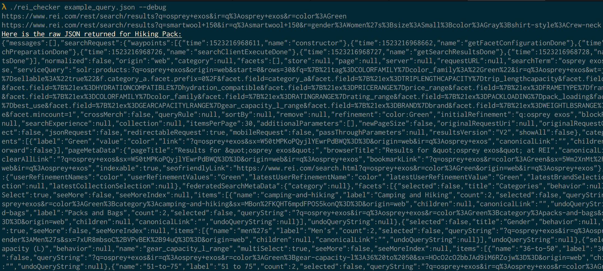

# rei_checker

Simple command line tool for checking REI's API for products.

The API isn't documented or anything, so hopefully this is okay. It will check for as many products as you put in the queries.json file and only checks once per run, so I think it's unlikely to put any strain on their server unless you have a ridiculous number of products you're interested in or run it on some kind of loop. Please don't do that.

## Installation

* You must have the Crystal toolchain installed: `https://crystal-lang.org`
* Clone the repository with `git clone https://github.com/gregcline/rei_checker.git`
* Build using `crystal build --release`.

I ran into an issue on OSX with Apple's SSL library causing problems when fetching from the API over HTTPS leading to this error: `SSL_connect: error:1407742E:SSL routines:SSL23_GET_SERVER_HELLO:tlsv1 alert protocol version`.

I found that installing `openssl` with homebrew and linking to that during the build fixed the issue: `crystal build src/rei_checker.cr  --link-flags '-I/usr/local/opt/openssl/include -L/usr/local/opt/openssl/lib' --release`

## Usage

Pretty basic CLI. Just run with the name of the query file you want to use as an argument. Once built run from the command line `--help` will give you all the info on it. You can run it normally: 

Have it only show you items on sale: 

Or get debug output: 

There is an example query file in the root directory. Since the API is undocumented this is just what I've reverse engineered and some parts of it might not be necessary. Essentially each part under params is part of the query string sent in the get request to the API.

The `q` param is just your search terms, `ir` seems to be just a restatement of the search terms. `r` is for refinements of the search, like limiting colors or sizes. The data in the `r` param *is* case sensitive e.g. `size:Small` is correct but `size:small` is not. To see options other than what I've used in the example, you'll have to look at the REI API yourself. I suggest running the tool in debug mode which will dump the raw JSON of the response, then looking at the `facets` section.

## Contributing

1. Fork it ( https://github.com/gregcline/rei_checker/fork )
2. Create your feature branch (git checkout -b my-new-feature)
3. Commit your changes (git commit -am 'Add some feature')
4. Push to the branch (git push origin my-new-feature)
5. Create a new Pull Request

## Contributors

- [gregcline](https://github.com/gregcline) Greg Cline - creator, maintainer
